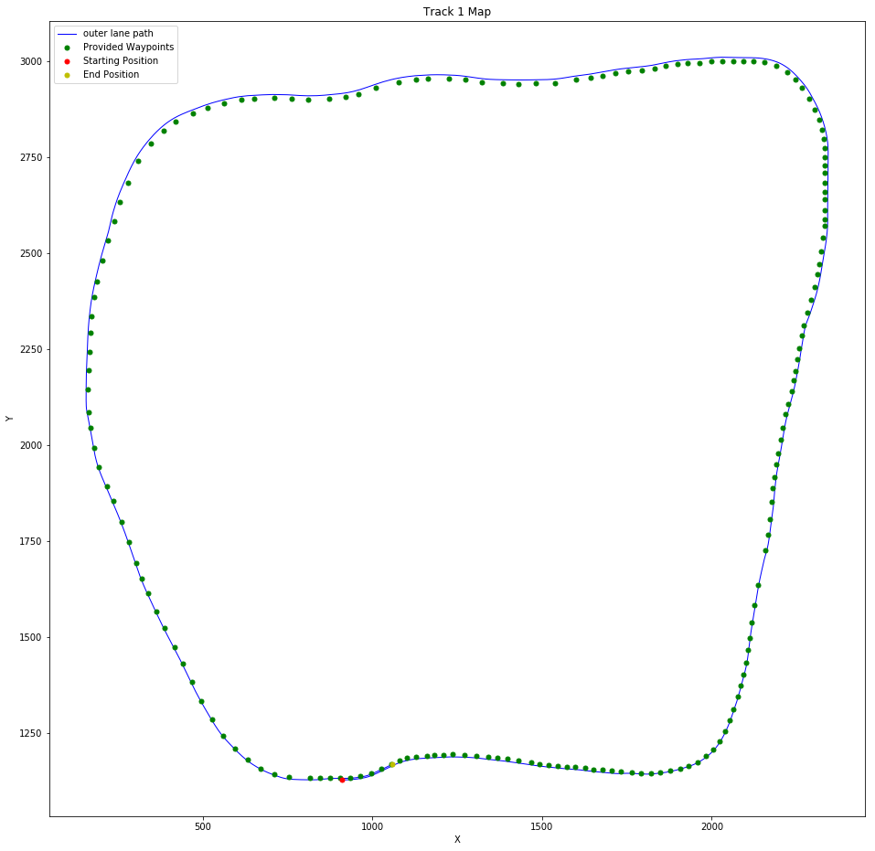
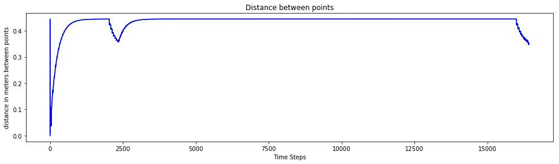
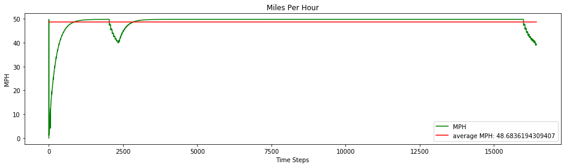
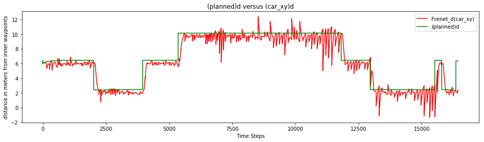
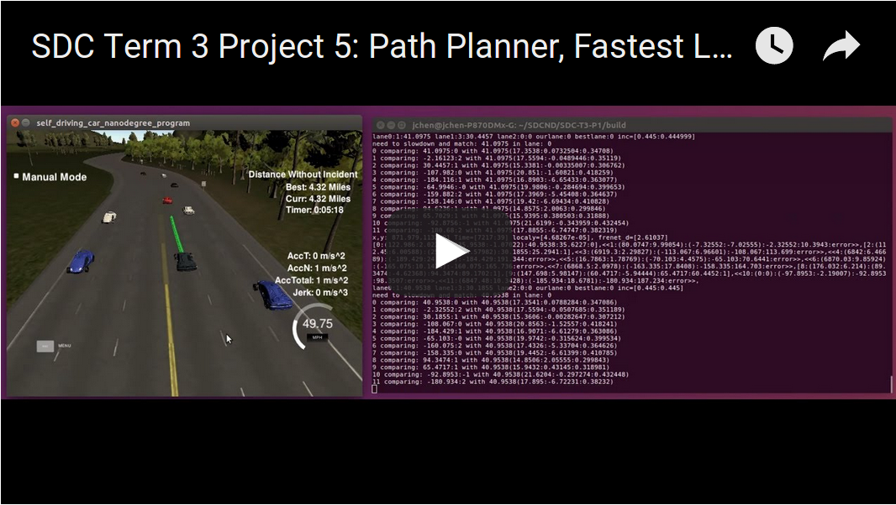
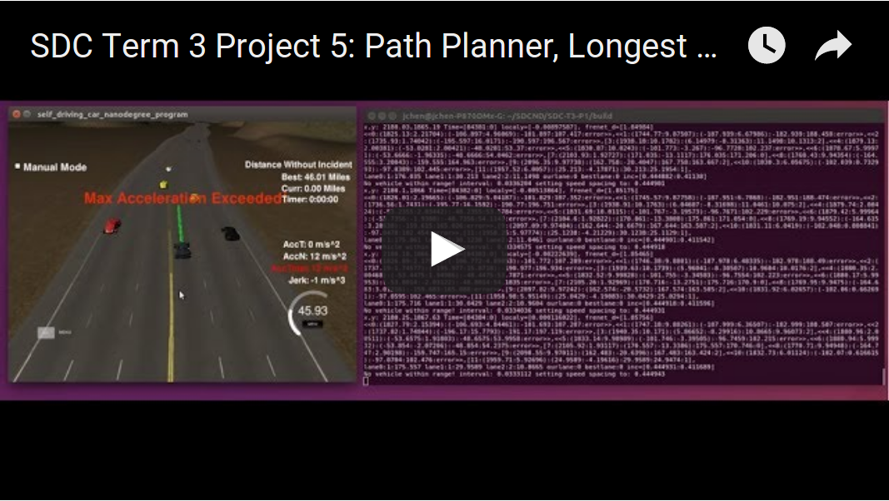

# SDC-T3-P1
Udacity SDC Term 3 Project 1: Path Planning

SDC-T3-P1 is a program written in C++ to plan and generate safe and smooth trajectories for a simulated self-driving car, driving along a 3 lane highway with traffic that is driving +-10 MPH of the 50 MPH speed limit.  The car's localization and sensor fusion data will be provided by the simulator, and there is also a sparse map list of waypoints around the highway. The car should try to go as close as possible to the 50 MPH speed limit, which means passing slower traffic when possible, note that other cars will try to change lanes too. The car should avoid hitting other cars at all cost as well as driving inside of the marked road lanes at all times, unless going from one lane to another. The car should be able to make one complete loop around the 6946m highway. Since the car is trying to go 50 MPH, it should take a little over 5 minutes to complete 1 loop. Also the car should not experience total acceleration over 10 m/s^2 and jerk that is greater than 50 m/s^3.

## Details

1. The car uses a perfect controller and will visit every (x,y) point it recieves in the list every .02 seconds. The units for the (x,y) points are in meters and the spacing of the points determines the speed of the car. The vector going from a point to the next point in the list dictates the angle of the car. Acceleration both in the tangential and normal directions is measured along with the jerk, the rate of change of total Acceleration. The (x,y) point paths that the planner recieves should not have a total acceleration that goes over 10 m/s^2, also the jerk should not go over 50 m/s^3. (NOTE: As this is BETA, these requirements might change. Also currently jerk is over a .02 second interval, it would probably be better to average total acceleration over 1 second and measure jerk from that.

2. There will be some latency between the simulator running and the path planner returning a path, with optimized code usually its not very long maybe just 1-3 time steps. During this delay the simulator will continue using points that it was last given, because of this its a good idea to store the last points you have used so you can have a smooth transition. previous_path_x, and previous_path_y can be helpful for this transition since they show the last points given to the simulator controller with the processed points already removed. You would either return a path that extends this previous path or make sure to create a new path that has a smooth transition with this last path.

#### The map of the highway is in data/highway_map.txt
Each waypoint in the list contains  [x,y,s,dx,dy] values. x and y are the waypoint's map coordinate position, the s value is the distance along the road to get to that waypoint in meters, the dx and dy values define the unit normal vector pointing outward of the highway loop.  The highway's waypoints loop around so the frenet s value, distance along the road, goes from 0 to 6945.554.  Below is an image of the track with provided waypoints, and a trace of the Fastest Lap.



#### Using Local Coordinates

At first we attempted to use Frenet(s,d) to generate the path (You may look at the previous attempts in the [src/old/](src/old) directory.), but it did not generate the smooth path that we desired.  So we looked back at our previous projects for inspirations and decided to use the local coordinate projection that we used for generating the Cross Track Error (CTE) in the MPC project.  If you recall, to generate the local coordinates base on the heading and position of the vehicle from a global coordinates, we subtract the vehicle's global x,y and rotate the map to the heading of the vehicle as can be seen in [src/main.cpp](src/main.cpp) lines 164 to 175. and graphically below:


We do the same operations in reverse to translate local coordinates to global coordinates as can be seen in [src/main.cpp](src/main.cpp) lines 176-184.  In order to generate the proper path, we locate the nearest waypoint to the vehicle and retrieve 6 previous waypoints and 18 next waypoints as can be seen in [src/main.cpp](src/main.cpp) lines 186-211.  Then we use the dx, dy waypoint information to generate trajectories the lane the car is currently on and if lane changing, the next lane that the car will be going to next as can be seen in [src/main.cpp](src/main.cpp) lines 186-211.  All path calculations are done in local coordinates.

A really helpful resource for doing this project and creating smooth trajectories was using http://kluge.in-chemnitz.de/opensource/spline/, the spline function is in a single hearder file is really easy to use.  Below is a graph of the smooth path generated by the path planner. We use it to generate the smooth transistion from 0 MPH to 49.75 MPH target as can be seen in [src/main.cpp](src/main.cpp) lines 461-518.  This can also be seen graphically below where the speed changes from 0 MPH from 0 time step to the 0.445 meters distance between 2 millisecond points that is equivalent to 49.75 MPH.



This path produced a smooth acceleration for the simulated car that also provided a maximum of 49.77195 MPH and average of 48.68362 MPH.



While at the same time provided smooth lane changes for passing slower cars on the 3 lane highway.  Notice most of the time, the lane changes do not effect the speed of the car, so as to maintain our high 48.68362 MPH average.  Only when our car is blocked, or if it is unsafe to pass at high speed do we slow down.  As can be seen by the graph below, the generated planned lane change from local/global coordinates does not translate well in Frenet coordinate space.  We were not quite sure what to make of this, other than there may be some warping that were not accounted when translating between coordinates.



#### Planner

The planner, as can be seen in [src/main.cpp](src/main.cpp) lines 620-888, is a very simple finite state machine to decide when to change lanes.  We decided not to use A* search for this project because while A* search would provide a great method for searching the optimal path, the resources for setting up the algorithm and the time to execute the search did not justify it for this use case, so we decided to use a simplier algorithm and use speed as our way to get out of traffic.  The planner will only change lanes if it is necessary, and it prefers to stay in its current lane when possible.  It prefers to change into lanes that have no vehicles ahead, but will stay in its current lane until it meets a vehicle at least 80 meters away.  While not perfect, it successfully uses a look ahead algorithm to predict if a faster vehicle in the other lanes will obstruct its lane changing decision and slow down instead.  These decisions are then passed to the trajectory generator, as can be seen in [src/main.cpp](src/main.cpp) lines 520-618 where its path planning decision are put into practice.  After this, the path is smooth one last time, as can be seen in [src/main.cpp](src/main.cpp) lines 890-944, before being sent back to the simulator for execution.

#### Visualization

As part of the path planner, we output a log of the planned path to [data/logger.csv](data/logger.csv) and wrote a Jupyter notebook to visualize the data: [tools/data_visualization.ipynb](tools/data_visualization.ipynb).  This was where the graphs shown above were generated.

## Fastest Lap
Using this path planner, our best lap time around the track for 4.32 Miles was 5 minutes 18 seconds from 0MPH as can be seen in the YouTube video below.  This is the same trace as the graphs shown above and in the Jupyter notebook.

[](https://youtu.be/Em3V2wy5hek)

## Longest Distance/Time without Incident
We were able to drive the simulated car around the track for 46.01 Miles/58 minutes and 29 seconds, more than 10 laps around the track.  Unfortunately, the video is too large to upload in its entirety, so we trimmed the video to the last 2 minutes 30 seconds of the capture for your enjoyment.

[](https://youtu.be/2IvvS1XEGO4)


## Installation

The latest term 3 simulator (v1.2) can be downloaded from  [https://github.com/udacity/self-driving-car-sim/releases/tag/T3_v1.2](https://github.com/udacity/self-driving-car-sim/releases/tag/T3_v1.2).

## Basic Build Instructions

**NOTE: Please make if you rerun the cmake, to use the `-DCMAKE_BUILD_TYPE=RelWithDebInfo`!  This will make the spline.h anonymous namespace referenceable.

1. Clone this repo.
2. Change to the build directory: `cd build`
3. Compile: `cmake -DCMAKE_BUILD_TYPE=RelWithDebInfo .. && make`
4. Run it: `./path_planning`.
5. Start the simulator

Here is the data provided from the Simulator to the C++ Program

#### Main car's localization Data (No Noise)

["x"] The car's x position in map coordinates

["y"] The car's y position in map coordinates

["s"] The car's s position in frenet coordinates

["d"] The car's d position in frenet coordinates

["yaw"] The car's yaw angle in the map

["speed"] The car's speed in MPH

#### Previous path data given to the Planner

//Note: Return the previous list but with processed points removed, can be a nice tool to show how far along
the path has processed since last time. 

["previous_path_x"] The previous list of x points previously given to the simulator

["previous_path_y"] The previous list of y points previously given to the simulator

#### Previous path's end s and d values 

["end_path_s"] The previous list's last point's frenet s value

["end_path_d"] The previous list's last point's frenet d value

#### Sensor Fusion Data, a list of all other car's attributes on the same side of the road. (No Noise)

["sensor_fusion"] A 2d vector of cars and then that car's [car's unique ID, car's x position in map coordinates, car's y position in map coordinates, car's x velocity in m/s, car's y velocity in m/s, car's s position in frenet coordinates, car's d position in frenet coordinates. 

---

## Dependencies

* cmake >= 3.5
 * All OSes: [click here for installation instructions](https://cmake.org/install/)
* make >= 4.1
  * Linux: make is installed by default on most Linux distros
  * Mac: [install Xcode command line tools to get make](https://developer.apple.com/xcode/features/)
  * Windows: [Click here for installation instructions](http://gnuwin32.sourceforge.net/packages/make.htm)
* gcc/g++ >= 5.4
  * Linux: gcc / g++ is installed by default on most Linux distros
  * Mac: same deal as make - [install Xcode command line tools]((https://developer.apple.com/xcode/features/)
  * Windows: recommend using [MinGW](http://www.mingw.org/)
* [uWebSockets](https://github.com/uWebSockets/uWebSockets)
  * Run either `install-mac.sh` or `install-ubuntu.sh`.
  * If you install from source, checkout to commit `e94b6e1`, i.e.
    ```
    git clone https://github.com/uWebSockets/uWebSockets 
    cd uWebSockets
    git checkout e94b6e1
    ```

## Conclusion

This has been a wonderfull project.  We wanted to work more on it.  Some ideas are:

1.  Send front camera images with the telemetries, so we can train an agent to drive the car in a highway environment with traffic.
2.  Link multple path planners together in a network and have them race around the highway.
3.  Use a modified version of my MLND keystone project to retrain SDCND Term 1 project 3 agents to drive in a highway environment with traffic.
